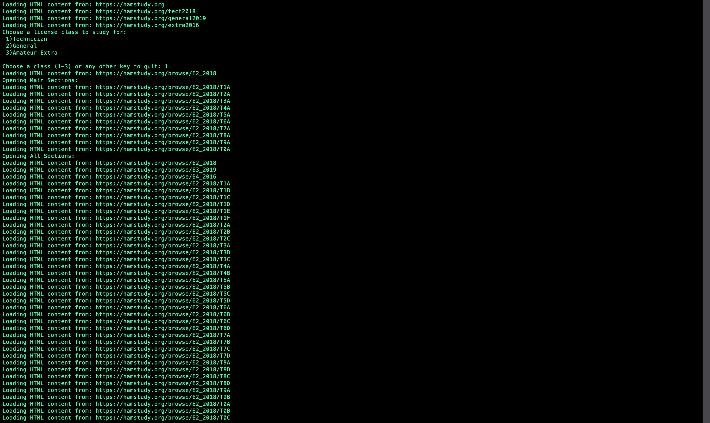
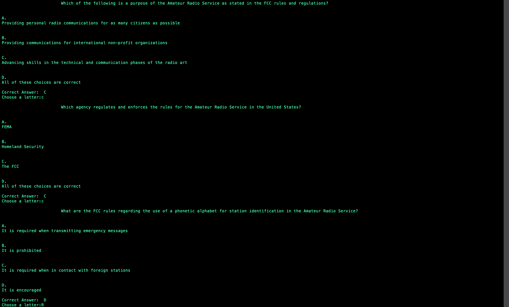

# Web_Scraping_Raio_Quiz
- Uses BeautifulSoup to get questions from the internet and form a quiz.
- Has a functional Scraper data type that is used to modularize bs4 code.
- Needs a GUI for the quiz and could store the questions in a data base like sqlite.

Loading Links and getting questions:

Displaying Quiz:

