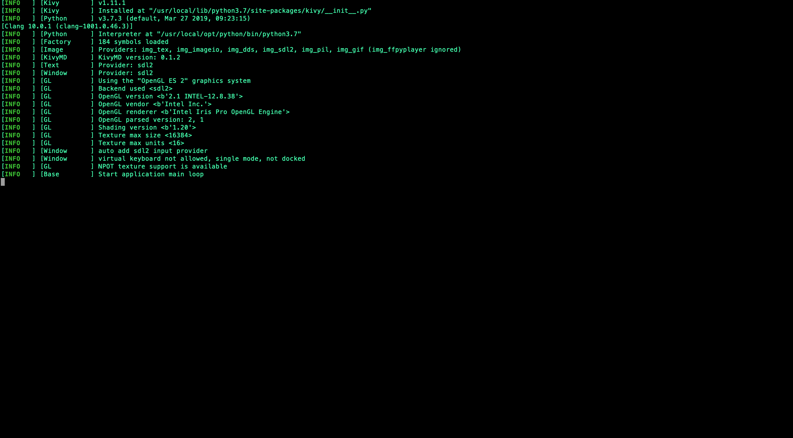
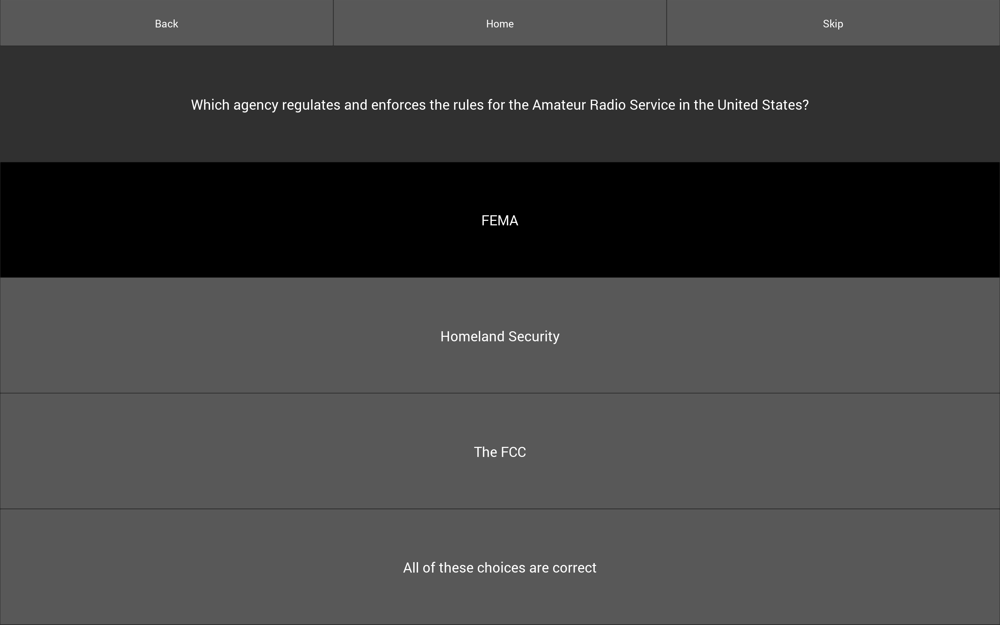
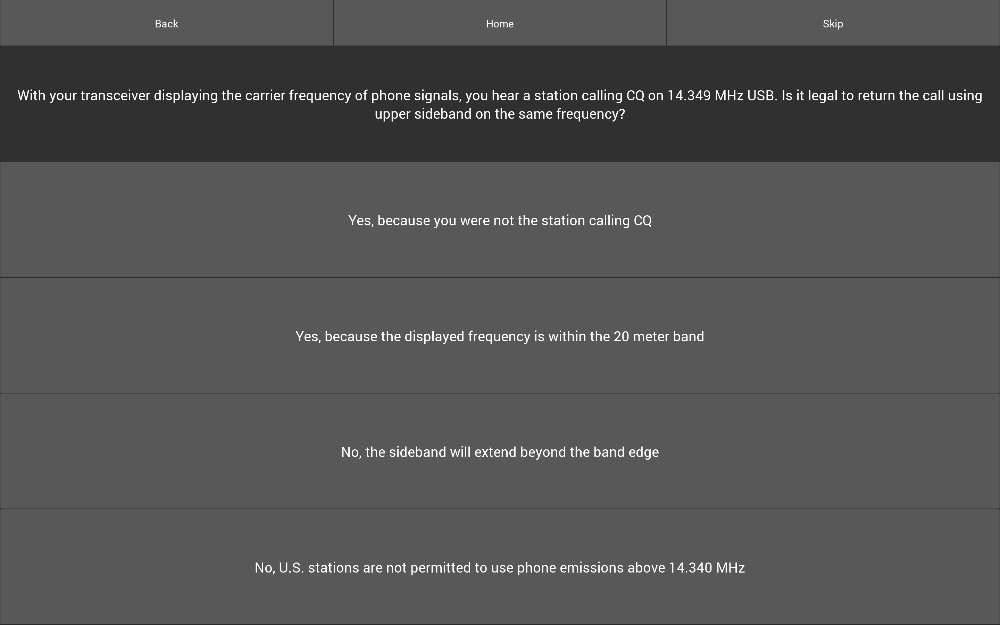
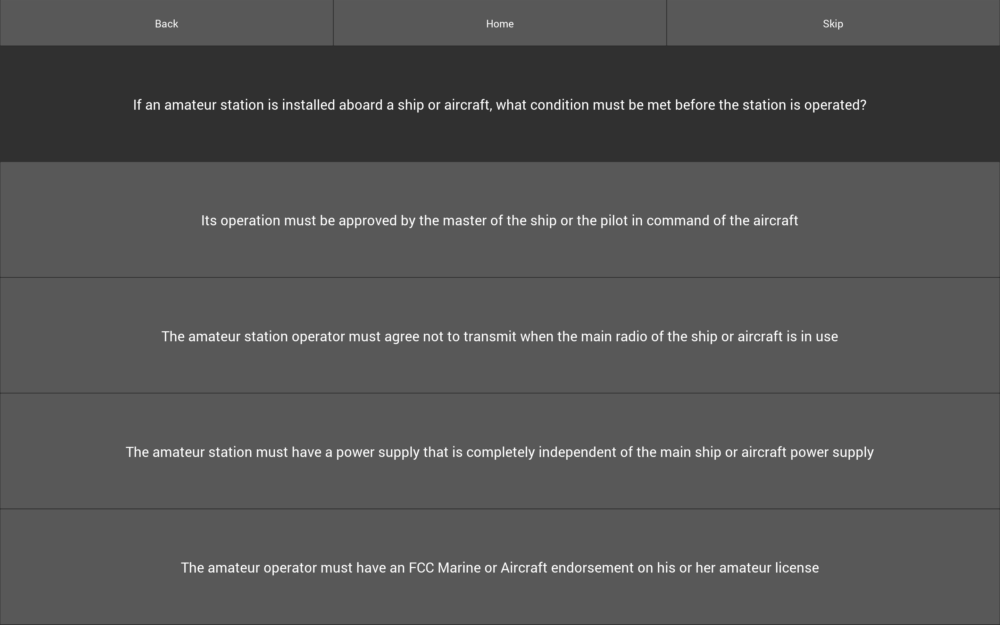
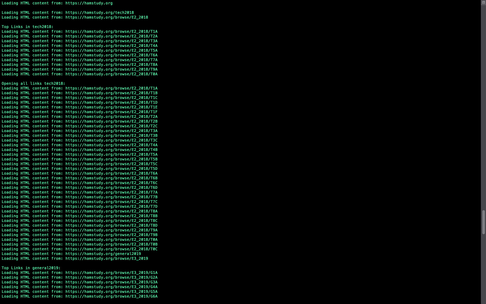
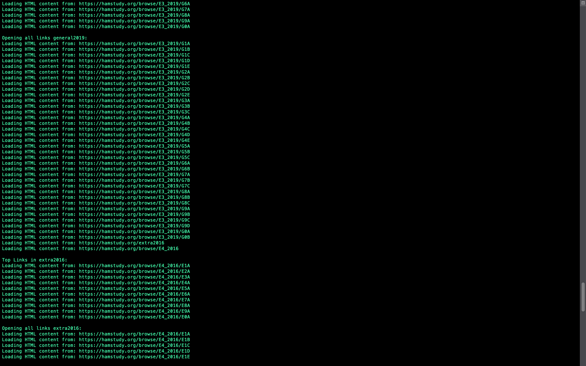
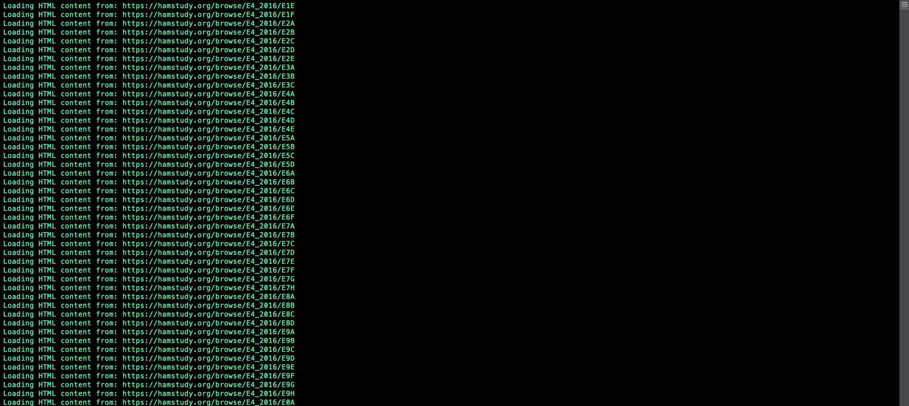

# Web_Scraping_Radio_Quiz
- Uses BeautifulSoup to get questions from the internet and form a quiz.
- Has a functional Scraper data type that is used to modularize bs4 code.
- Has a GUI uising KIVY

**TODO:**
- needs indicator for when a question is right or wrong
- needs to display score 
- should store questions in db not a text file

Start Up:

Sample Question:

Sample Question:

Sample Question:

Sample Question:

Updating Questions:

Updating Questions:

Updating Questions:

